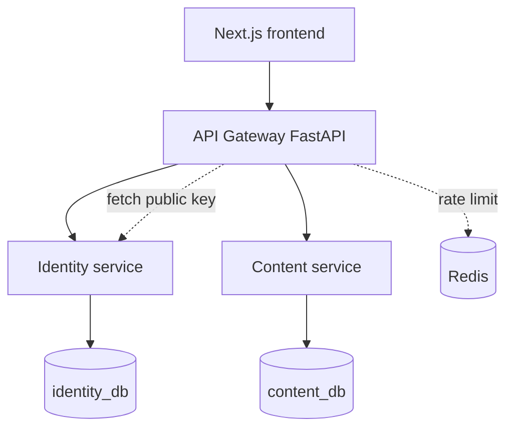

# Hiver v1 Plan

Community discussion platform. Domain language: [`CONTEXT.md`](../CONTEXT.md).

## Goal

- **Primary:** Full-stack product reviewers can click through end-to-end.
- **Secondary (light D):** Tests, CI, migrations, documented setup, live deploy on free tiers.

## Product

| Item | Decision |
|------|----------|
| Name | **Hiver** — community discussion platform |
| URLs | `/` home · `/c/{name}` community · `/c/{name}/posts/{id}` post |
| UI | Reddit-inspired 3-column layout, shadcn/ui, **dark mode default**, dark green / forest colors |
| Audience | Client project — explicit naming (`/c/` = community), not competing with Reddit |

## Architecture

Hiver runs as a small set of services behind a single gateway (distributed-system architecture, split at the slice-2 boundary). See [ADR-0002](./adr/0002-microservices-split.md).

| Service | Owns | Notes |
|---------|------|-------|
| **Gateway** | Routing, CORS, JWT verify, rate limiting | Single public entry; frontend base URL unchanged |
| **Identity** | `users`, `refresh_tokens`, `karma` | Issues **RS256** JWTs (`sub` + `username` claims, `kid` header); exposes JWKS |
| **Content** | `communities`, `memberships`, `posts`, `comments`, `votes` | Trusts JWT claims; no live call to Identity on the hot path |

**Cross-service rules**

- **No cross-service FKs.** Content stores `author_id`/`creator_id`/`user_id` as plain strings, not foreign keys into `users`.
- **Author snapshot.** `posts`/`comments` carry `author_username` (+ optional `author_avatar_url`), copied from JWT claims at write time — no join to `users`.
- **Stateless auth.** Identity signs with a private key; Gateway/Content verify with the public key. Content decodes the token into a lightweight `CurrentUser` (no DB lookup).
- **Eventual karma.** Votes update per-item `score` in Content locally; a "vote-applied" event (outbox) updates `user.karma` in Identity.
- **Repo:** monorepo — `services/{identity,content,gateway}` + `frontend/`.
- **Deliberately skipped:** Nginx (gateway proxies), Kafka (outbox suffices), GraphQL (unrelated). Redis added only for gateway rate limiting.

## v1 journeys (must work)

1. **Guest read** — browse global feed, community pages, posts, and comments without an account
2. **Auth** — sign up, log in, log out; JWT access + refresh tokens ([ADR-0001](./adr/0001-jwt-access-and-refresh-tokens.md))
3. **Home feed** — logged-in members see posts from joined communities; global feed fallback + personalization banner when no joins
4. **Join / leave** community
5. **Create community** — any logged-in user; creator auto-joins as first member
6. **Create text post** — title + optional body; **must be a member** of the community
7. **Comments** — comment and nested reply, up to **10 levels** deep
8. **Votes** — upvote/downvote posts and comments; **live karma** shown next to usernames
9. **Delete** — author deletes own post/comment → `[deleted]` placeholder; thread structure preserved

## Deferred to v2

- Link and image posts
- User profile pages
- Feed sorting (hot / top)
- Search
- Moderation tools (lock, mod roles)
- Email verification, password reset, OAuth

## Rules

| Area | Rule |
|------|------|
| Access | Public read; auth required for vote, comment, post, join, create community |
| Feeds | Guests → global; members → home (joined only); **newest-first** everywhere |
| Membership | Required to post in a community |
| Karma | Updated when votes change; displayed on posts/comments only (no profile page) |
| Comments | Max depth 10; visual indent caps ~4 levels in UI |

## Seed content

Loaded for demo; not login-able.

| Item | Value |
|------|-------|
| Communities | `films`, `music`, `webdev` |
| Posts | ~4 per community |
| Comments | 1–2 threads on one post |
| Authors | 3 display-only seed users |

## Engineering (light D)

**In v1**

- API integration tests (pytest + httpx) per must-have journey
- GitHub Actions: `ruff` + `pytest` per service (CI matrix over `services/*`)
- Alembic migrations per service (Identity and Content each own their schema)
- `docker-compose` runs the full system locally (gateway, identity, content, both DBs, Redis)
- `.env.example` + README (local setup + deploy)
- FastAPI `/docs` on each service

**Out of v1**

- Playwright E2E
- Sentry
- mypy in CI

## Deploy (final step — free tiers only)

| Layer | Platform |
|-------|----------|
| Frontend | Vercel (Hobby) |
| Gateway | Railway or Fly.io |
| Identity service | Railway or Fly.io |
| Content service | Railway or Fly.io |
| Databases | Neon Postgres (`identity_db`, `content_db`) |
| Rate-limit cache | Redis (Upstash free tier) |

Run after v1 works locally. Seed script populates both DBs on deploy or via one-off command. Three deployables means three cold-start surfaces — acceptable for this project.

## Build order (vertical slices)

Each slice ships API + UI + tests before moving on. Slices 1-2 are complete as a monolith; the **architecture split (2.5)** lands before any cross-domain write path is built, so the remaining slices are built service-first and never write the coupling a split would have to undo. See [Architecture](#architecture) and [ADR-0002](./adr/0002-microservices-split.md).

| # | Slice | Demo milestone |
|---|-------|----------------|
| 1 | Auth (register, login, logout, refresh) | Account works (→ Identity service) |
| 2 | Read feeds (global, community, post detail) | App looks alive (→ Content service) |
| **2.5** | **Architecture split** (gateway + Identity + Content, RS256 JWT, claims auth, author snapshot, per-service DB/CI) | Distributed system runs end-to-end |
| 3 | Join / leave + home feed logic | Personalization works (Content, claims-based) |
| 4 | Create community | New `/c/...` exists (Content, author snapshot) |
| 5 | Create text post | User publishes content (Content, no user FK) |
| 6 | Comments + replies | Threads work (Content) |
| 7 | Votes + karma | Engagement works (score local to Content; karma → Identity via event) |
| 8 | CI, seed polish, README | Production-shaped (per-service CI matrix) |
| 9 | Deploy | Live URL |

## Frontend routes

| Route | Purpose |
|-------|---------|
| `/` | Home (global or personalized) |
| `/c/[name]` | Community feed + join |
| `/c/[name]/posts/[id]` | Post + comment thread |
| `/login`, `/register` | Auth |
| `/create-community` | New community |
| `/c/[name]/submit` | New text post |

## Auth detail (v1)

| In | Out |
|----|-----|
| Email + password + username sign-up | Email verification |
| JWT access token (15 min) | Password reset |
| Refresh token (7 days, DB-stored, revocable) | OAuth |

See [ADR-0001](./adr/0001-jwt-access-and-refresh-tokens.md).
